# Creating & Importing 3D Landscape Models into ARKit

The workflow below discusses one way to create an __Augmented Reality__ scene of a real-world landscape using [Blender3d](https://www.blender.org) and Apple's [ARKit](https://developer.apple.com/arkit/). 

* Using Blender, a 3D landscape is authored using public domain elevation data and aerial imagery.  
* The 3D landscape is then imported into an __ARKit__ Xcode project to create a 'table-top' __Augmented Reality__ scene.  
* The Augmented Reality scene can be explored by using a pan gesture to rotate and tilt the mountain landscape.


Figure: Mt. Rainier Augmented Reality scene using ARKit.

### Part 1: Get Elevation Data

Acquire your elevation data (i.e. DEM or height map) from the public domain.  In this example, we fetch an elevation model of Mt. Rainier, Washington.

### Part 2: Create 3D Mesh with Height Map

1) Open Blender.

2) Delete the default cube.

3) Add a Plane Mesh.

4) __Create a Subdivision Surface Modifier__.  Click on Modifiers and do the following (see screenshot below): 

* Choose __Add a modifier__

* Choose __Subdivision Surface__

* Choose __Simple__ (default is Catmull-Clark)

* Enter Subdivision View as __6__

* Enter Subdivision View as __6__
	
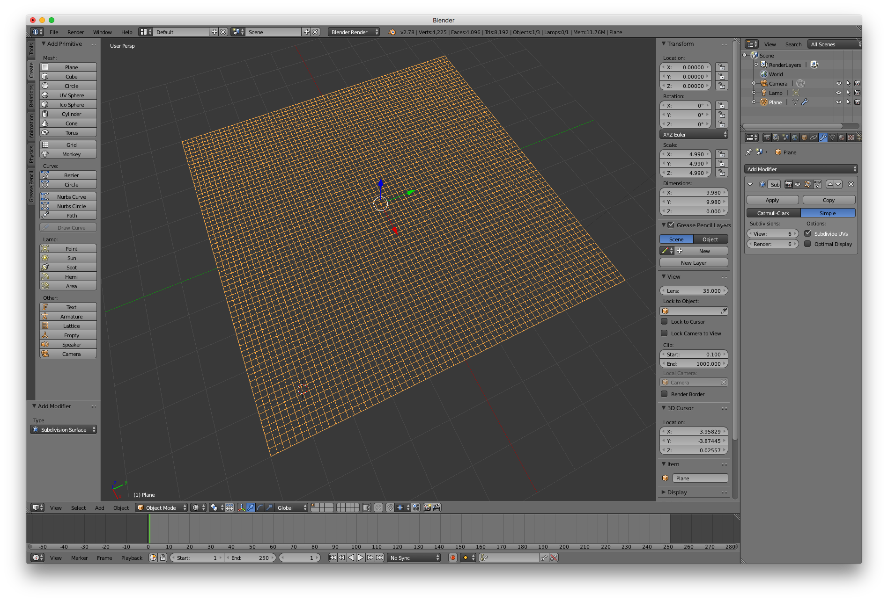

5) __Create a Displace Modifier__.  Click on Modifiers and do the following (see screenshot):

* Choose __Add a modifier__

* Choose __Displace__

* Under Texture, click __New__ (see screenshot below)

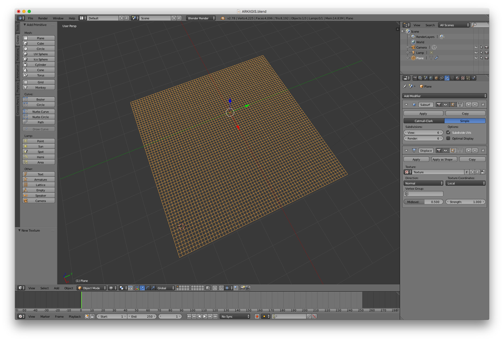

* Click the right-most icon button from the Texture with the tooltip __Show texture in texture tab__. See screenshot below.

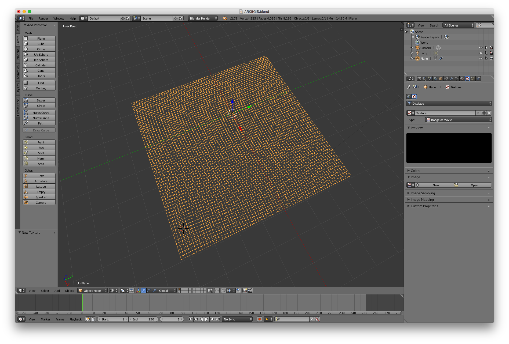

* Confirm that the Texture Type is __Image or Movie__

* Click the __Open__ button and choose a height map downloaded from Part 1.  The mesh will now take on the 3D data from the height map! See screenshot below.

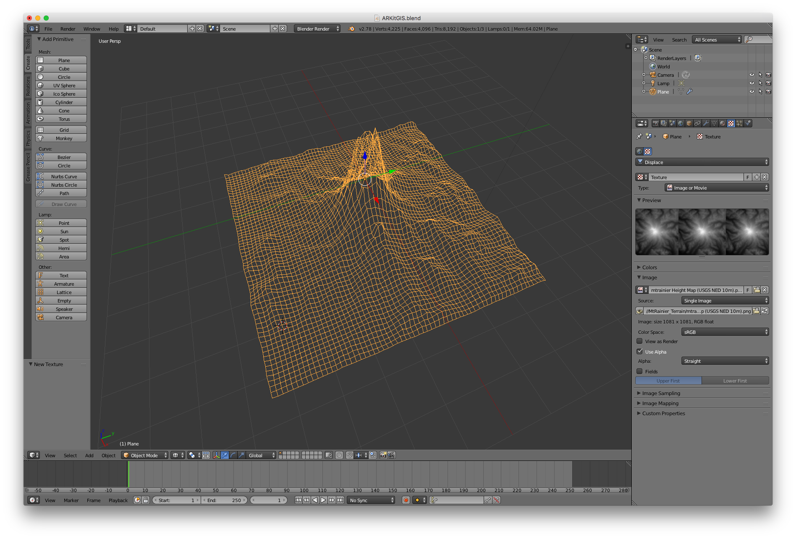

* Choose a Color Space of __linear__ (deafult is sRGB).  See screnshot below.

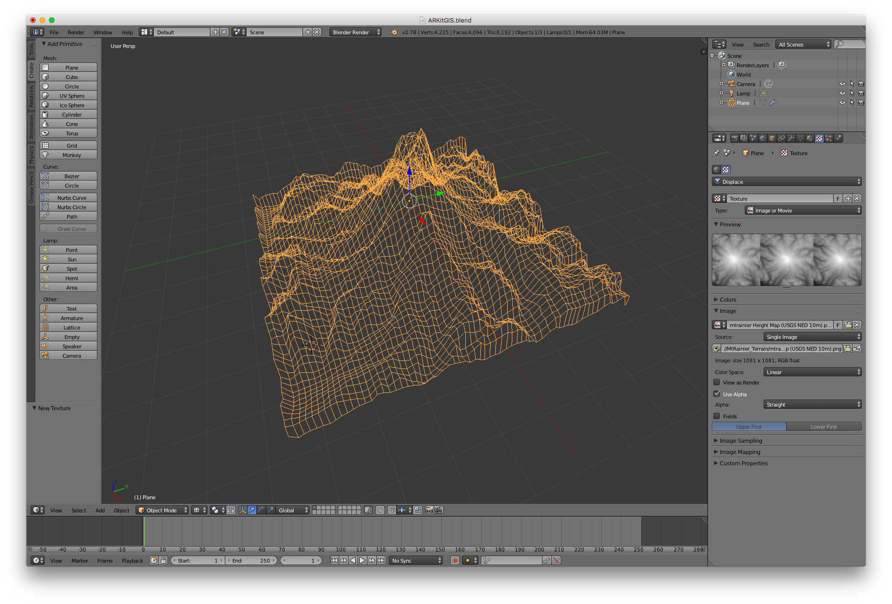

* Switch the viewport shading to __Solid__.

* Finess the parameters of the previously added Modifiers to work with the data in your landscape of interest.  See screenshot below:
	* For the Subsurface Modifier, the Subdivions were updated to View = __9__ and Render = __9__.
	* For the Displace Modifier, the Strength was change from the deafult of __1.0__ to __0.5__.

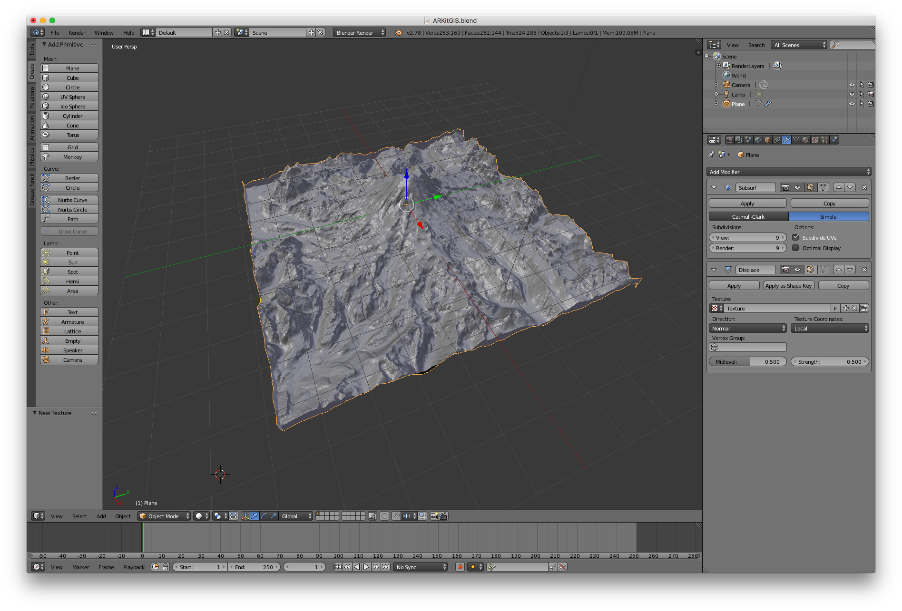

### Part 3: Add the Aerial as a Texture

1) Acquire an aerial image for the same geographic extent as your height map.

2) Add a material to the 3D mesh (see screenshot below).

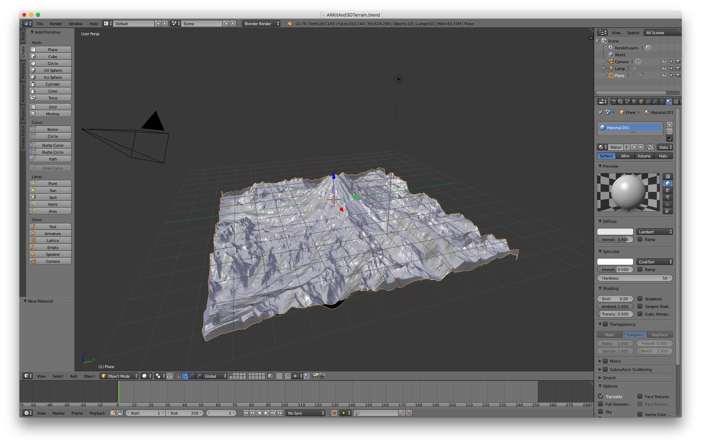

3) With the material selected, click the Texture button.

4) Click 'New' to create a new texture (see screenshot below).

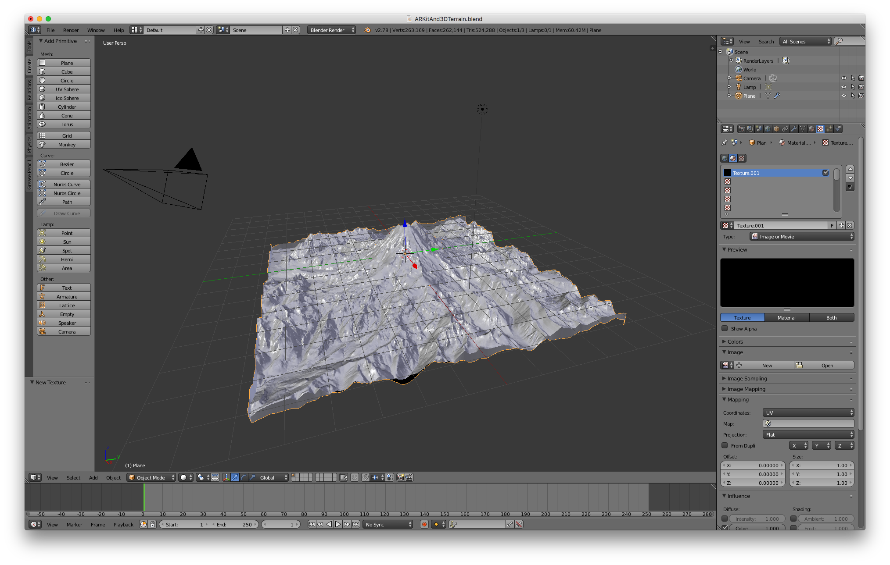

5) In Image section, click the __Open__ button and navigate to the image.

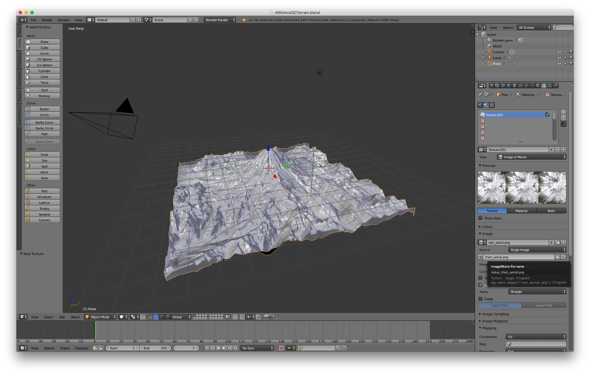

4) Switch to __UV Editing__ mode (see screenshot below).

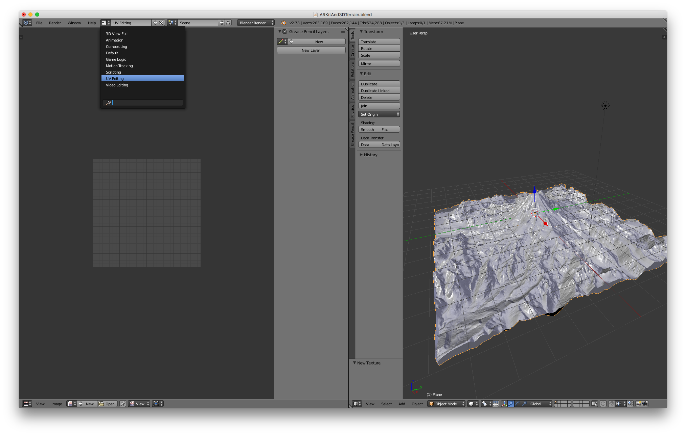

* On the bottom left, choose the aerial image.

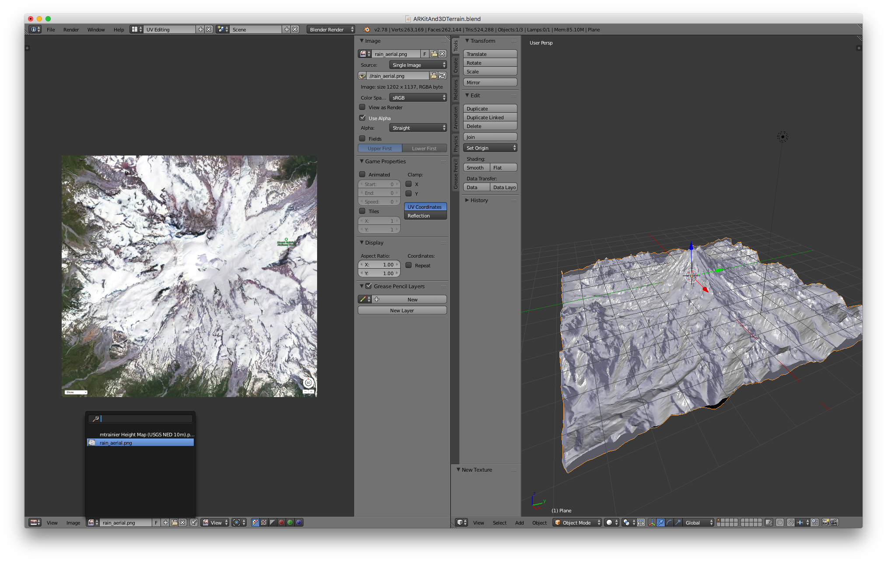

5) On the right-window, select the 3D mesh.

* Select the 3D mesh and enter __Edit Mode__

* While your mouse cursor is hovering over the mesh, Press U

* Choose __unwrap__

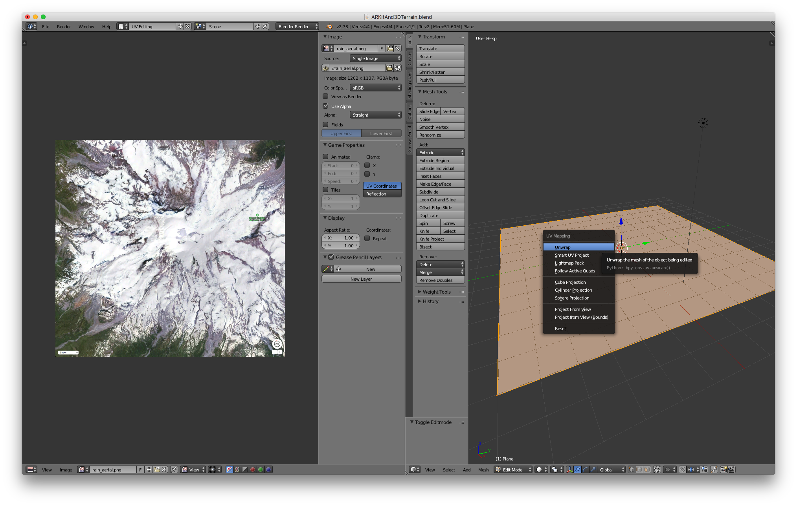

* Switch back to Object Mode

* Choose a View Port Shading of Material

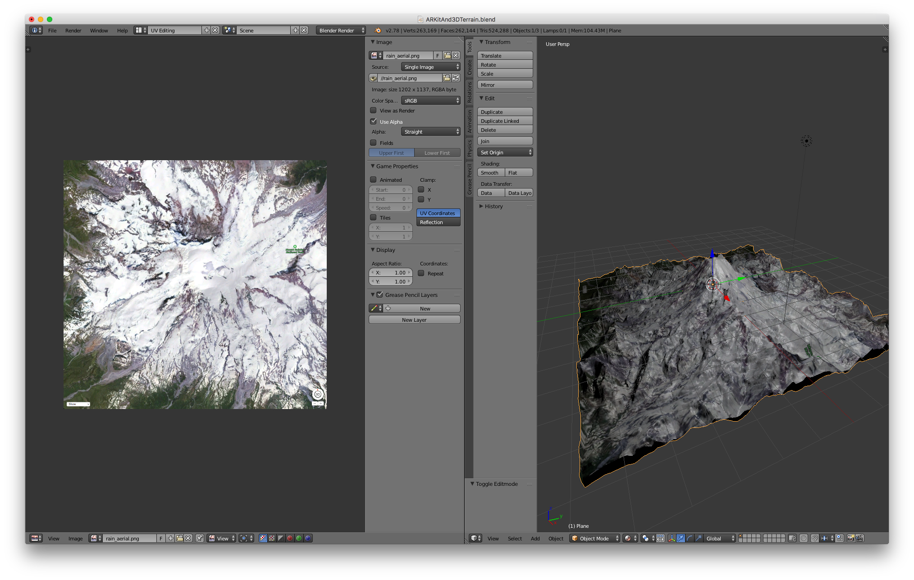

* Switch back from UV Editing mode to __Deafult Mode__ to close the left window.

### Part 4: Export for use with ARKit

1) Choose File (menu) > Export > Collada (dae)

2) Under the 'Export Data Options', check on __Apply Modifiers__.  This will ensure that the exported plane will have the 3D form of the height map.

3) Under the 'Texture Options', check on __Include Material Textures__'

4) Choose a location for the export and choose __Export Collada__.

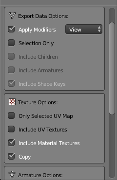

### Part 5: Integrate into ARKit project using SceneKit

1) Create a new Xcode project (use the AR template).

2) Add the exported Collada (dae) file into the __art.scnassets__ folder. 

3) Add the aerial image used as the material-texture into the __art.scnassets__ folder.

4) Confirm the 3d model renders correctly in the Scene Editor.

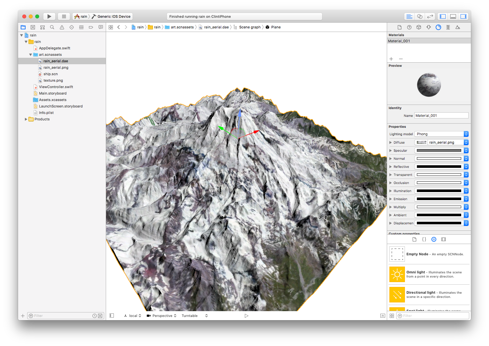

5) When creatting a scene, simply point to to the .dae file.

````
	// Create a new scene
	guard let scene = SCNScene(named: "art.scnassets/mt_rainier.dae") else {
		return
	}
        
	// Set the scene to the view
	sceneView.scene = scene
````

6) Play with repositioning the 3D landscape in the Scene Editor and run.  Point your phone at a table and it should resemble ...

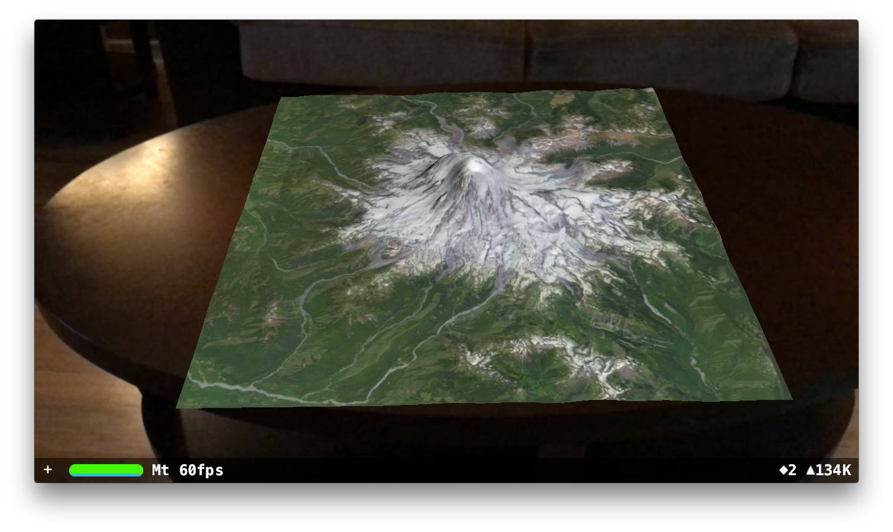

Continue hacking at your AR scene!

## Connect

* Twitter: [@clintcabanero](http://twitter.com/clintcabanero)
* GitHub: [ccabanero](http:///github.com/ccabanero)
